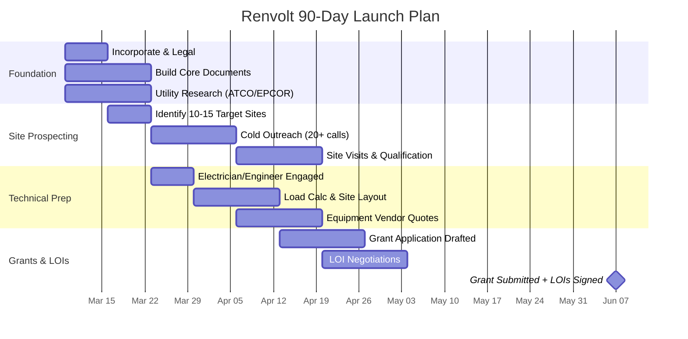

# Renvolt 90-Day Launch Plan — First EV Charging Site

*Your fractional co-founder playbook: from idea to signed LOIs and submitted grant application in 90 days.*

---

## Working Assumptions

| Parameter | Assumption | Rationale |
|---|---|---|
| Site size | **4-6 chargers** (not 12) | Start smaller to reduce CapEx and risk for pilot |
| Charger power | 100-150 kW DC fast (CCS1/CCS2) | Standard for public fast-charging |
| Battery co-location | 100 kWh LFP | Demand charge shaving + grid services |
| Pre-grant CapEx | ~$200K (4 chargers + battery) | Half-site proves economics at lower risk |
| Post-grant CapEx | ~$100-120K | ZEVIP/provincial covers 40-50% of hardware |
| Year 1 utilization | **8-12%** (realistic for ~1,500 EVs in Alberta) | Not 30% — be honest with investors |
| Charging price | $0.40-0.55/kWh | Competitive with Petro-Canada/FLO |
| Year 1 revenue/site | **$70-110K** (conservative) | Based on realistic utilization |
| Payback (post-grant) | **14-20 months** (adjusted) | Honest number; still investor-attractive |
| Target city | Edmonton or Calgary | Highest EV density in Alberta |

> [!IMPORTANT]
> I recommend starting with **4-6 chargers**, not 12. A 4-charger pilot costs ~$200K pre-grant vs $350K, proves the same economics, and is far easier to permit and deploy. Scale to 12 at site #2 once you have real data.

---

## 90-Day Overview

---

## Week-by-Week Milestones

### Week 1-2: Foundation & Research

**Key Decisions:**
- Edmonton or Calgary for first site? (Edmonton has EPCOR; Calgary has ENMAX — different utility processes)
- Sole proprietorship → incorporation? (Recommend Alberta corporation for grant eligibility and liability)
- 4-charger pilot or 6-charger? (I'd start with 4)

**Documents to Create:**
- [ ] **Site Host Pitch One-Pager** (see template below)
- [ ] **Basic Financial Model** — simple spreadsheet: CapEx, monthly revenue at 8/12/20% utilization, payback
- [ ] **Company Overview** — 1-page about Renvolt for grant applications

**Who to Talk To:**
- **Alberta Corporate Registry** — incorporate ($275-$500 filing fee)
- **ATCO or EPCOR** — call their commercial services line and ask: *"What's the process and cost to add 80-150kW of commercial load to an existing gas station or commercial property?"*
- **NRCan ZEVIP program office** — call and ask: *"When is the next intake? What documentation do I need? Can I apply before I have a signed site agreement?"*
- **Alberta Municipal Affairs** — ask about the Alberta Electric Vehicle Charging Program (EVCP) timeline

---

### Week 3-4: Site Prospecting & Cold Outreach

**Key Decisions:**
- Which 10-15 sites to target? (Criteria below)
- Revenue-share model: what % to offer the host? (Recommend 10-15% of charging revenue)

**Site Selection Criteria (rank all targets):**

| Criterion | Why It Matters | How to Check |
|---|---|---|
| **Traffic volume** | More cars = more potential EV drivers | Drive by, count cars, check Google traffic data |
| **Existing electrical service** | 200A+ 3-phase = easy upgrade; 100A single-phase = expensive | Ask owner or check meter panel on-site |
| **Proximity to highway/major road** | Highway travelers need fast charging most | Google Maps |
| **Competitor proximity** | >10 km from existing DC fast charger = better | PlugShare app / NRCan station locator |
| **Parking space available** | Need 4-6 spots preferably at lot edge | Site visit |
| **Owner willingness** | Franchise vs. independent? Independent owners decide faster | Cold call |
| **Lease term available** | Need minimum 7-10 years | Negotiation |

**Target Types (in priority order):**
1. **Independent gas stations** on highway corridors (QE2 between Edmonton-Red Deer-Calgary)
2. **Strip mall / plaza owners** with large parking lots near major intersections
3. **Hotel chains** near highways (Best Western, Holiday Inn — EV drivers need overnight charging)
4. **Municipal parking lots** (City of Edmonton has expressed interest in EV infrastructure)
5. **Fleet operator yards** (delivery companies, rental car lots)

**Tasks:**
- [ ] Build a target list of 15 sites using Google Maps + PlugShare
- [ ] Cold-call/email 20+ site owners (see script below)
- [ ] Schedule 3-5 in-person site visits
- [ ] Drive the QE2 corridor and take photos/notes of candidate locations

---

### Week 5-6: Technical Preparation

**Key Decisions:**
- Charger brand: ABB Terra vs. Tritium RT vs. ChargePoint Express? (Get 3 quotes)
- Battery system: containerized vs. pad-mounted? (Recommend pad-mounted for pilot — cheaper, simpler)
- Hire a P.Eng. for stamped drawings? (Yes — mandatory for >400A commercial service in Alberta)

**Who to Talk To:**
- **Licensed electrician (Master Electrician)** — someone experienced with commercial EV installs. Ask your local IBEW chapter or the Alberta Safety Codes Council for recommendations
- **Professional Engineer (P.Eng.)** — for stamped electrical drawings and load calcs. Budget $8-15K
- **Charger distributors** — ABB, Tritium, and ChargePoint all have Canadian reps. Request formal quotes.
- **Battery vendors** — Canadian Solar EP Cube, BYD Battery-Box, SimpliPhi — get quotes for 100kWh systems

**Documents to Create:**
- [ ] **Load Calculation Summary** (use the Grok template as starting point, have P.Eng. validate)
- [ ] **Preliminary Site Layout Sketch** (parking spots, charger locations, battery pad, conduit run to panel)
- [ ] **Equipment Comparison Matrix** (3 charger brands, 3 battery options — price, specs, warranty, lead time)

---

### Week 7-8: Grant Application & LOI Negotiation

**Key Decisions:**
- Which grant to apply to first? ZEVIP (federal) or EVCP (provincial)?
- LOI terms: what revenue share, what lease length, who pays for electrical upgrade?

**Documents to Create:**
- [ ] **Grant Application Package** (see checklist below)
- [ ] **Site Host LOI Template** (see template below)
- [ ] **Draft Revenue-Share Agreement** (get a lawyer to review — budget $2-5K)

**Who to Talk To:**
- **NRCan ZEVIP** — submit application or confirm intake window
- **Your top 2-3 site hosts** — negotiate LOI terms
- **Business lawyer** — to draft/review LOI and revenue-share agreement. Use an Alberta business lawyer familiar with commercial leases. Budget $2-5K.

---

### Week 9-10: Site Qualification & Engineering

**Tasks:**
- [ ] P.Eng. completes stamped load calc and site drawings for top 1-2 sites
- [ ] Utility confirms service upgrade cost and timeline for top sites
- [ ] Finalize charger and battery vendor quotes
- [ ] Refine financial model with real costs (not estimates)

---

### Week 11-12: Close LOIs & Submit Grant

**Milestone Targets:**
- [ ] **1-2 signed LOIs** from site hosts
- [ ] **1 grant application submitted** (ZEVIP or EVCP)
- [ ] **Firm equipment quotes** from 2+ vendors
- [ ] **Utility confirmation** of service upgrade cost and timeline for site #1
- [ ] **Updated financial model** with real numbers → ready for investor conversations

---

## Week 1 Exact To-Do List

> [!TIP]  
> Print this. Check items off. This is your entire first week.

1. **Register an Alberta corporation** — Alberta Corporate Registry, online, $275-$500. Name: "Renvolt Ltd." or similar
2. **Open a business bank account** — you need this for grant applications. ATB Financial or RBC.
3. **Call EPCOR (Edmonton) or ENMAX (Calgary)** — ask: *"What's the process, cost, and timeline to add 80-150 kW of commercial 3-phase load to an existing commercial property?"* Write down everything.
4. **Call NRCan ZEVIP program office** (1-800-387-2000) — ask: *"When is your next intake? What are the eligibility requirements? Can I apply as a new company?"*
5. **Download the ZEVIP application guide** from NRCan website. Read it cover to cover. Highlight what you need.
6. **Search the NRCan EV station locator** (+ PlugShare app)** — map every existing DC fast charger within 50 km of your target area. Identify *gaps* in coverage.
7. **Drive your target corridor** (QE2 or Yellowhead or Whitemud) — photograph 10 candidate sites. Note: parking layout, panel location (outside wall), traffic volume, nearby amenities.
8. **Create your Site Host Pitch One-Pager** (use template below)
9. **Build a simple financial model** in Google Sheets: CapEx, monthly revenue at 8%/12%/20% utilization, demand charge savings, payback period. One page.
10. **Identify and call 5 independent gas station owners** along your target corridor. Use the cold-call script below.
11. **Find a licensed Master Electrician** experienced with commercial EV installs. Ask for a 30-minute consultation ($0-$150). Get their assessment of typical service upgrade costs in your area.
12. **Email 3 charger distributors** (ABB, Tritium, ChargePoint) — request pricing for 4× 100-150kW DC fast chargers, delivered to Edmonton/Calgary. Ask about lead time.
13. **Set up a simple CRM** — even a Google Sheet: site name, owner, phone, email, status, notes. Track every conversation.
14. **Read 3 case studies** of Canadian EV charging deployments (FLO, Ivy Charging, Petro-Canada). Note what worked and what didn't.

---

## Questions to Ask Site Hosts (First 3-5 Meetings)

Use these in conversation — don't read them like a survey. **Listen more than you talk.**

### Understanding Their Situation
1. *"How many cars come through your lot on a typical day? What about weekends?"*
2. *"Have you noticed any EVs stopping here or nearby? Has anyone ever asked if you have charging?"*
3. *"What's your current electrical setup here? Do you know if it's single-phase or three-phase? What size is your main breaker?"* (Don't worry if they don't know — you'll check the panel later.)
4. *"Do you own this property or lease it? How long is your lease?"*

### Gauging Interest
5. *"Have you ever thought about adding EV charging here?"*
6. *"What if someone installed chargers at no cost to you, maintained everything, and paid you a monthly share of the revenue? Would that interest you?"*
7. *"What would your concerns be about having EV charging equipment on your property?"*

### Logistics
8. *"Do you have 4-6 parking spots that are underutilized — maybe at the edge of your lot?"*
9. *"Where's your electrical panel? Can I take a look?"* (Bring a phone — photograph the panel label.)
10. *"Would you be willing to sign a Letter of Intent if the economics looked right? Nothing binding — just a statement of interest so we can apply for government grants together."*

---

## Cold-Call / Email Script

### Phone Script (90 seconds max)

> *"Hi, my name is (Your Name). I run a company called Renvolt — we install EV fast-charging stations at commercial properties across Alberta.*
>
> *I'm reaching out because your location on (street/highway) looks like a strong fit for an EV charging site. Here's the quick version:*
>
> *We install the chargers, we pay for the equipment, we handle all the maintenance. There's zero cost to you. In exchange, you'd receive (10-15)% of the charging revenue as a monthly payment — and you'd get more foot traffic from EV drivers who stop to charge and come inside.*
>
> *The government is covering 40-50% of the hardware cost through grants right now, so we're moving quickly to lock in the best locations before the funding runs out.*
>
> *Would you be open to a 15-minute conversation this week? I can come to you — I just want to take a quick look at your lot and electrical setup."*

### Email Version

**Subject:** Free EV Charging Revenue for (Business Name) — No Cost to You

> Hi (Owner Name),
>
> My name is (Your Name), and I'm the founder of Renvolt. We install EV fast-charging stations at commercial properties in the Edmonton/Calgary area.
>
> I noticed your property at (address) and think it could be a strong location for EV charging. Here's how it works:
>
> - **We pay for everything** — chargers, installation, permitting, maintenance
> - **You pay nothing** — zero upfront cost, zero ongoing cost
> - **You earn monthly revenue** — a percentage of every charging session
> - **You attract new customers** — EV drivers spend 20-40 minutes charging and often shop or eat nearby
>
> The Alberta and federal governments are currently offering grants that cover 40-50% of hardware costs, so we're actively looking for the best locations before the funding window closes.
>
> Would you be open to a brief call or meeting this week? I'd love to learn more about your property and see if it's a good fit.
>
> Best regards,
> (Your Name)
> Founder, Renvolt
> (Phone) | (Email)

---

## Technical Prep Checklists

### Before Speaking to a City Permitting Office

You need:
- [ ] **Alberta corporation registration** (certificate of incorporation)
- [ ] **Site address** and legal land description
- [ ] **Preliminary site plan** showing charger and battery locations on the lot (sketch is fine for initial inquiry — they'll tell you what they need)
- [ ] **Load calculation summary** — total kW demand, net demand after battery, service size required
- [ ] **Equipment spec sheets** from charger and battery manufacturers (download from vendor websites)
- [ ] Know the **zoning** of your site (commercial, industrial, mixed-use) — check the city's zoning map online

**What to ask the permitting office:**
- *"Do I need a development permit for EV charging equipment on a commercially-zoned property?"*
- *"What triggers a building permit vs. just an electrical permit?"*
- *"Does battery storage require any additional permits (fire, environmental)?"*
- *"What's your typical turnaround time for commercial electrical permits?"*

### Before Speaking to an Electrician / Engineering Firm

You need:
- [ ] **Site address + photos** of the existing electrical panel (close-up of the panel label showing amperage, voltage, phases)
- [ ] **Equipment spec sheets** (charger input voltage, amperage, power rating)
- [ ] **Load calculation draft** (they'll refine it, but having a starting point saves billable hours)
- [ ] **Site layout sketch** showing distance from panel to proposed charger locations
- [ ] **Budget range** — tell them upfront you're budgeting $8-15K for engineering and $30-50K for electrical install

**What to ask:**
- *"Can this panel support an additional 80-150 kW of load, or do we need a service upgrade?"*
- *"If we need a service upgrade, what's the estimated cost and timeline?"*
- *"Can you provide stamped drawings for the city permit application? What's your fee?"*
- *"Have you done any EV charger installs before?"* (If not, find someone who has.)

### Before Speaking to a Grant Program (ZEVIP / EVCP)

You need:
- [ ] **Incorporated company** with a business number (CRA)
- [ ] **Site location** (even tentative — most grants allow changes before final reporting)
- [ ] **Equipment quotes** from at least one vendor (even preliminary)
- [ ] **Basic project budget** — total CapEx, amount of grant requested, your co-investment
- [ ] **Environmental / climate impact estimate** — tonnes of CO₂ displaced (use NRCan's calculator or estimate: 1 EV charging session ≈ 2-4 kg CO₂ avoided vs. gasoline)
- [ ] **Letters of support** — even a 1-paragraph email from a site host saying "we're interested in hosting" helps

---

## Top 5 Mistakes & How to Avoid Them

### 1. Picking a Site Without Checking Grid Capacity

> **The mistake:** You sign an LOI, apply for grants, order equipment... then discover the site has a 100A single-phase panel that can't support *any* fast chargers. Utility upgrade: $50-80K and 6 months.

**How to avoid it:** **Check the electrical panel BEFORE you pitch the site host.** Drive by, look at the meter/panel on the outside wall, photograph the label. If it says "100A" or "single-phase" — move on unless the utility confirms a cheap upgrade.

### 2. Overestimating Year 1 Utilization

> **The mistake:** You project 30% utilization and promise investors $288K/year/site. Reality: 8-12% utilization in Year 1 (Alberta has ~1,500 EVs total). Revenue is $70-110K. You miss your targets and lose investor trust.

**How to avoid it:** **Model three scenarios** (8%, 12%, 20% utilization) and lead with the conservative one. Show investors you're honest about timing, and that the economics *still work* at low utilization thanks to demand charge savings and grid services revenue.

### 3. Signing a Bad Site Agreement

> **The mistake:** You do a verbal handshake deal with a gas station owner. You install $200K of equipment. Two years later, the owner sells the property and the new owner wants you out. You have no legal recourse.

**How to avoid it:** **Get a written agreement** with a minimum 7-10 year term, right of first refusal if the property is sold, and clear terms for equipment removal. Spend $2-5K on a lawyer — it's the best money you'll ever spend.

### 4. Ignoring Alberta Winter

> **The mistake:** Your charger screens freeze at -30°C, the battery loses 25% capacity in extreme cold, and the concrete pad cracks from frost heave. Equipment fails in January — your busiest month for highway travel.

**How to avoid it:** Specify **cold-rated equipment** (-40°C operating range), budget for **heated battery enclosures** ($5-10K extra), use **frost-protected concrete pads** (48" depth for frost line in Edmonton), and confirm your charger warranty covers cold-weather failures.

### 5. Applying for Grants Without a Real Site

> **The mistake:** You submit a ZEVIP application with "TBD" for the site location. The application is deprioritized or rejected because the review committee can't assess feasibility.

**How to avoid it:** **Have at least a signed LOI** (even non-binding) before you submit your grant application. Include the site address, a photo, and a support letter from the host. Grant reviewers fund *projects*, not *ideas*.

---

## Site Host LOI Template

> **LETTER OF INTENT — EV CHARGING STATION**
>
> Date: ___________
>
> **Between:**
> Renvolt Ltd. ("Renvolt")
> (Your address)
>
> **And:**
> (Site Host Business Name) ("Host")
> (Host address)
>
> **RE: Installation of EV Fast-Charging Equipment at (Site Address)**
>
> This Letter of Intent expresses the mutual interest of Renvolt and Host in the installation and operation of electric vehicle fast-charging equipment at the Host's property located at the above address.
>
> **Proposed Terms (Non-Binding):**
> 1. Renvolt will install, own, and maintain 4-6 DC fast-charging stations and associated battery storage equipment at the Host's property
> 2. Renvolt will bear all costs of equipment, installation, permitting, and ongoing maintenance
> 3. Host will provide designated parking spaces and access to electrical infrastructure
> 4. Host will receive (10-15)% of gross charging revenue as a monthly payment
> 5. Proposed term: 10 years with option to renew
> 6. Renvolt will maintain comprehensive insurance covering all installed equipment
>
> **This LOI is non-binding** and does not create any legal obligation. A definitive agreement will be negotiated and executed prior to any installation.
>
> ___________________________
> (Your Name), CEO, Renvolt Ltd.
>
> ___________________________
> (Host Name), (Title), (Host Business)

---

## Site Host Pitch One-Pager (Template)

> ### Earn Monthly Revenue from EV Charging — At Zero Cost to You
>
> **Renvolt** installs and operates EV fast-charging stations at commercial properties across Alberta.
>
> **How It Works:**
> - We install 4-6 DC fast chargers at your property
> - We pay 100% of the cost — equipment, installation, permits, maintenance
> - You pay nothing — ever
> - You receive **(10-15)%** of all charging revenue as a monthly payment
>
> **What You Get:**
> - **Monthly passive income** — charging revenue deposited directly to your account
> - **More customers** — EV drivers spend 20-40 minutes on-site while charging
> - **Property value increase** — EV-ready properties are increasingly desirable
> - **Green credentials** — demonstrate sustainability to your community
>
> **What We Handle:**
> - All equipment and installation costs
> - Permitting and electrical work
> - 24/7 monitoring and maintenance
> - Customer payment processing
> - Insurance on all installed equipment
>
> **Why Now?**
> The Government of Canada (ZEVIP) and Province of Alberta are currently offering grants covering 40-50% of EV charging hardware costs. These programs have limited funding and defined intake windows. Properties secured now will be first to benefit.
>
> **Next Step:** A 15-minute meeting to visit your property and assess feasibility. No commitment required.
>
> **Contact:**
> (Your Name) | (Phone) | (Email)
> Renvolt Ltd. | Edmonton, AB
